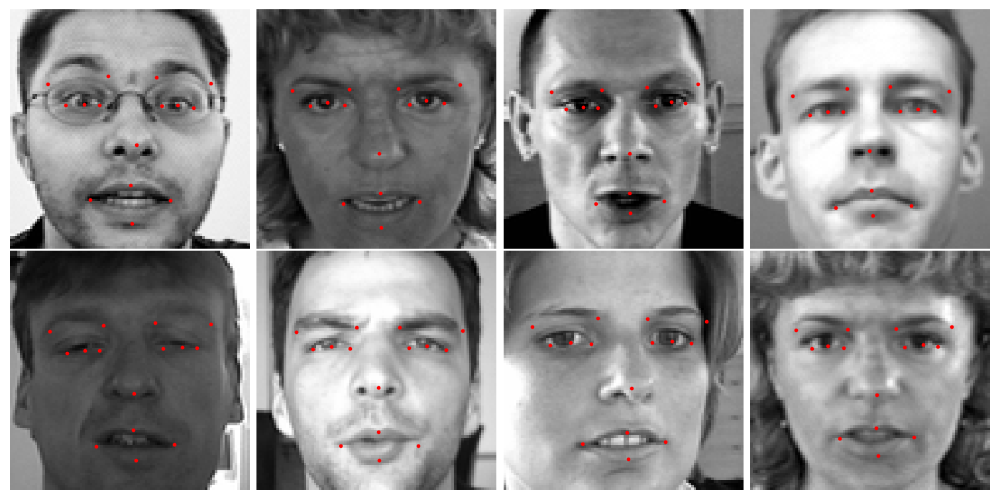
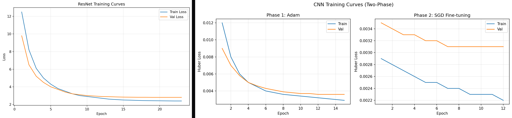

# Facial Keypoints Detection

<div align="center">

**Dual-framework deep learning system for detecting 15 facial keypoints on 96×96 grayscale images**

[](https://python.org)
[](https://pytorch.org)
[](https://tensorflow.org)
[](LICENSE)
[](https://www.kaggle.com/c/facial-keypoints-detection)

</div>

---

Built for the [Kaggle Facial Keypoints Detection](https://www.kaggle.com/c/facial-keypoints-detection) competition. Implements both a **PyTorch ResNet** with custom NaN-aware loss and a **Keras CNN** with two-phase training, achieving **RMSE 2.10** on the leaderboard.

<div align="center">

<br>
<em>ResNet predictions: detected keypoints (red) on unseen test faces</em>
</div>

## Results

| Model | Framework | Kaggle RMSE | Parameters | Strategy |
|-------|-----------|:-----------:|:----------:|----------|
| **ResNet** | PyTorch | **2.10** | ~4.2M | Adam + StepLR + NaN-aware MSE |
| CNN | TensorFlow/Keras | 2.55 | ~1.5M | Two-phase: Adam → SGD + Huber |

<div align="center">

<br>
<em>Training curves — Left: ResNet (Adam + StepLR) | Right: CNN (Two-Phase Adam → SGD)</em>
</div>

## Key Innovation: NaN-Aware Loss

Only ~2,140 of 7,049 training samples have all 15 keypoints labeled. Rather than discarding ~70% of the data, the custom `MSELossIgnoreNan` masks missing targets and computes gradients only on available labels:

```python
class MSELossIgnoreNan(nn.Module):
    def forward(self, pred, target):
        mask = torch.isfinite(target)
        count = mask.sum()
        if count == 0:
            return torch.tensor(0.0, requires_grad=True)
        return ((pred[mask] - target[mask]) ** 2).sum() / count
```

## Features

- **Dual-framework architecture** — PyTorch ResNet and Keras CNN sharing data loading and configuration
- **NaN-aware loss** — Custom `MSELossIgnoreNan` trains on all 7,049 samples including partially-labeled ones
- **Two-phase CNN training** — Adam for fast convergence, then SGD with ReduceLROnPlateau for fine-tuning
- **Deep residual learning** — 6-stage ResNet (32→512 channels) with batch normalization and skip connections
- **Centralized YAML config** — All hyperparameters in `config/default.yaml` with typed frozen dataclass validation
- **Unit tests** — pytest suite covering models, loss functions, dataset utilities, and config loading

## Project Structure

```
├── config/default.yaml         # Hyperparameters for both models
├── keypoints/
│   ├── config.py               # Frozen dataclasses + YAML loader
│   ├── models/
│   │   ├── cnn.py              # Keras CNN (3 conv blocks + 2 FC layers)
│   │   └── resnet.py           # PyTorch ResNet (12 residual blocks)
│   └── utils/
│       ├── dataset.py          # Data loading, preprocessing, PyTorch Dataset
│       ├── losses.py           # MSELossIgnoreNan
│       └── visualization.py    # Keypoint plotting, training curves
├── tests/
│   └── test_models.py          # Unit tests for models, loss, dataset, config
├── train_cnn.py                # CNN training entry point
├── train_resnet.py             # ResNet training entry point
├── predict.py                  # Inference + Kaggle submission
└── assets/                     # Sample output visualizations
```

## Quick Start

### Installation

```bash
git clone https://github.com/allureking/FacialKeypointsDetection.git
cd FacialKeypointsDetection

# Install with both frameworks
pip install -e ".[all]"

# Or install for one framework only
pip install -e ".[pytorch]"    # PyTorch ResNet only
pip install -e ".[tensorflow]" # Keras CNN only
```

### Download Data

Download the [Kaggle dataset](https://www.kaggle.com/c/facial-keypoints-detection/data) and place files in `data/`:
```
data/
├── training.csv
├── test.csv
└── IdLookupTable.csv
```

### Train

```bash
# Train ResNet (PyTorch)
python train_resnet.py --config config/default.yaml

# Train CNN (Keras/TensorFlow)
python train_cnn.py --config config/default.yaml
```

### Predict

```bash
# Generate Kaggle submission
python predict.py --model resnet --weights best_model.pth
python predict.py --model cnn --weights sgd_best.h5
```

### Run Tests

```bash
pytest tests/ -v
```

## Architecture

### ResNet (PyTorch)

```
Input (1×96×96)
  └── Stem: Conv(1→32) + BN + ReLU + MaxPool
      └── Stage 1: ResBlock×2 (32→32)
          └── Stage 2: ResBlock×2 (32→64)
              └── Stage 3: ResBlock×2 (64→128)
                  └── Stage 4: ResBlock×2 (128→256)
                      └── Stage 5: ResBlock×2 (256→512)
                          └── AdaptiveAvgPool → Linear(512→30)
```

Each residual block: `x → Conv3×3 → BN → ReLU → Conv3×3 → BN → (+shortcut) → ReLU`

### CNN (Keras)

```
Input (96×96×1)
  └── Conv2D(32) → LeakyReLU → MaxPool → Dropout(0.05)
      └── Conv2D(64) → LeakyReLU → MaxPool → Dropout(0.01)
          └── Conv2D(128) → LeakyReLU → MaxPool → Dropout(0.15)
              └── Dense(500) → Dense(500) → Dense(30)
```

Two-phase training: Adam (lr=5e-4) with Huber loss → SGD (lr=1e-3) with ReduceLROnPlateau.

## Configuration

All hyperparameters are centralized in `config/default.yaml` and loaded into frozen dataclasses:

```yaml
resnet:
  batch_size: 16
  learning_rate: 0.0001
  epochs: 100
  patience: 5
  step_lr_size: 5
  step_lr_gamma: 0.1
```

## References

- He, K. et al. (2016). *Deep Residual Learning for Image Recognition*. CVPR. [arXiv:1512.03385](https://arxiv.org/abs/1512.03385)
- Kaggle. *Facial Keypoints Detection*. [Competition Page](https://www.kaggle.com/c/facial-keypoints-detection)

## Acknowledgments

CNN implementation developed in collaboration with Felix-hyy for the USF 276DS course final project. ResNet architecture inspired by the Advanced Machine Learning course at USF.

## License

MIT — see [LICENSE](LICENSE) for details.
